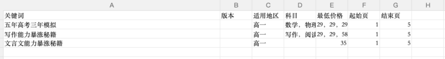
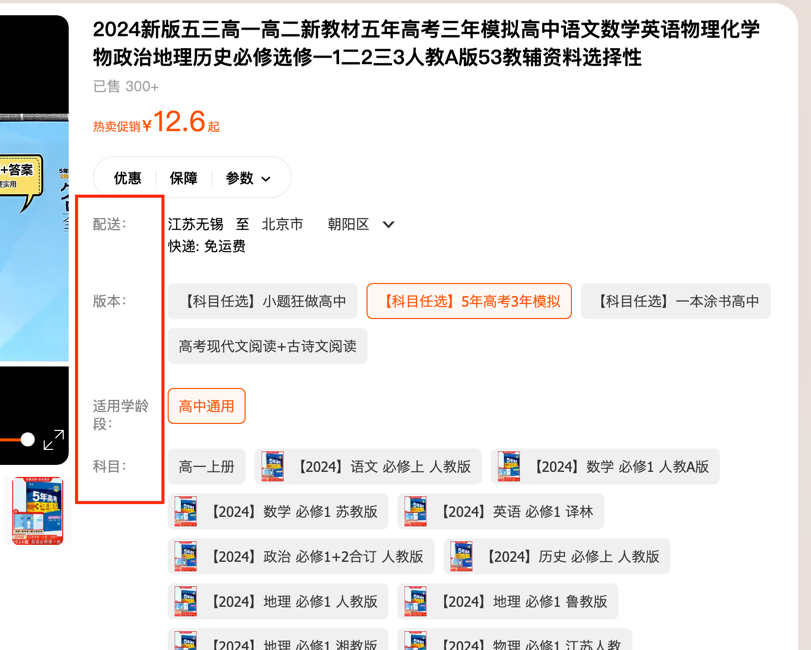

# taobao控价工具使用说明

Date: December 5, 2023
Status: Not started

## 安装依赖

```bash
pip install -r requirements.txt
```

## 运行

### cookie过期处理

如果cookie过期了，执行python文件的时候，执行

```bash
python [taobaoCrawler.py](http://taobaocrawler.py/) needlogin
```

后续当天再登录就不需要新cookie了，执行

```bash
python [taobaoCrawler.py](http://taobaocrawler.py/)
```

安装好依赖之后，找到[taobaoCrawler.py](http://taobaocrawler.py/)文件，运行即可

## 输入文件

> 文件可以用Execl编辑，.csv格式存储就好
>

> 文件当中的关键字应当尽量精炼，因为是模糊匹配的
>

传入格式为如下图所示：



其中：

- 版本号对应
- 适用地区对应
    - 高一、高二、等等

  

- 科目包括

    > 科目之间用中文，隔开！
    >
    - 语文、数学、英语。。。
    - 科目组合：格式可以为“语文+数学+。。。”，如果害怕匹配不上多写一些格式就行比如：语文+数学，语数，语+数。。。。

### 传文件demo

[crawl.csv](taobao%E6%8E%A7%E4%BB%B7%E5%B7%A5%E5%85%B7%E4%BD%BF%E7%94%A8%E8%AF%B4%E6%98%8E%20754f1dddcf4c4a5b9989c22a980b473c/crawl.csv)

## 验证码跳过

### 简单验证码

遇到普通的滑块验证码，需要进行不断尝试（一般尝试6～7次就会进入），如果尝试的次数超过了10次，大概率是监测到机器人，解决方案就是在电脑上手动辅助进行滑动，一般手动两三次就可以

### 复杂验证码


若遇到类似的验证码，脚本会尝试删除浏览器cookie，然后重新尝试登录，需要人手动配合（最好能有Cookie池）

若重新登录之后仍然带有该验证码检验，则需要人手动进行验证

## 输出文件

[淘宝爬取商品结果2023-12-05_14-34-38.xlsx](taobao%E6%8E%A7%E4%BB%B7%E5%B7%A5%E5%85%B7%E4%BD%BF%E7%94%A8%E8%AF%B4%E6%98%8E%20754f1dddcf4c4a5b9989c22a980b473c/%25E6%25B7%2598%25E5%25AE%259D%25E7%2588%25AC%25E5%258F%2596%25E5%2595%2586%25E5%2593%2581%25E7%25BB%2593%25E6%259E%259C2023-12-05_14-34-38.xlsx)

[淘宝爬取商品结果2023-12-05_15-27-12.xlsx](taobao%E6%8E%A7%E4%BB%B7%E5%B7%A5%E5%85%B7%E4%BD%BF%E7%94%A8%E8%AF%B4%E6%98%8E%20754f1dddcf4c4a5b9989c22a980b473c/%25E6%25B7%2598%25E5%25AE%259D%25E7%2588%25AC%25E5%258F%2596%25E5%2595%2586%25E5%2593%2581%25E7%25BB%2593%25E6%259E%259C2023-12-05_15-27-12.xlsx)


分为以下几列，商品名称、sku学科、价格、销量、商品店铺名称、归属地、商品链接、设定的最低价、差价（指与设定的价格的差距）